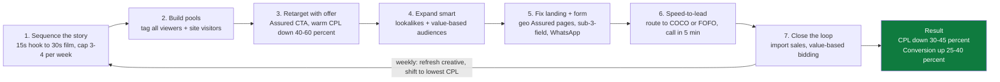

# DriveX — ₹30L Campaign Impact (v2: re-baselined + Taboola)

> **Authored by:** Performance Marketing Strategist 8F1A
> **Supersedes the channel mix in** [`drivex-corporate-film-media-impact.md`](drivex-corporate-film-media-impact.md). This revision implements the v1 recommendations: LinkedIn re-baselined to a realistic CPM, and a low-cost native line (Taboola) added.
> **Status:** Modeled estimate, reconciled to ₹30,00,000. Delivery figures are arithmetic; search-lift and brand-lift figures are modeled against category benchmarks and are **not guarantees**.
> **Companion deck:** generated with Gamma (PPTX → import into Google Slides).

---

## 1. Revised ₹30L media plan — 4 channels

| Channel | Asset | Budget | CPM | CPV / VTR | Views | Impressions |
|---|---|---:|---:|---:|---:|---:|
| YouTube | 30s skippable | ₹12,00,000 | ₹180 | CPV ₹1.2 | **10.0 L** | 66.7 L |
| YouTube | 15s non-skip | ₹6,00,000 | ₹240 | 85% views | **21.3 L** | 25.0 L |
| LinkedIn | Video (B2B) | ₹7,00,000 | ₹450 | CPV ₹1.5 | **4.7 L** | 15.6 L |
| Taboola | Native video | ₹5,00,000 | ₹180 | CPV ₹1.0 | **5.0 L** | 27.8 L |
| **Total** | | **₹30,00,000** | | | **~40.9 L** | **~135.0 L** |

**Per-channel math**

```
YouTube 30s skippable : views 12,00,000/1.2 = 10,00,000 ; impr 12,00,000/180x1000 = 66,66,667 ; VTR 15%
YouTube 15s non-skip  : impr 6,00,000/240x1000 = 25,00,000 ; completed 85% = 21,25,000 ; ₹0.28/view
LinkedIn video        : impr 7,00,000/450x1000 = 15,55,556 ; views 7,00,000/1.5 = 4,66,667 ; view rate 30%
Taboola native        : impr 5,00,000/180x1000 = 27,77,778 ; views 5,00,000/1 = 5,00,000 ; view rate 18%
```

**Blended delivery:** ~**1.35 crore impressions** · ~**40.9 lakh video views** · ~**35–42 lakh unique reach** (Chennai + Bangalore) at ~**3–3.5x** frequency · blended CPM **~₹222**.

Taboola adds incremental reach on news/content sites *beyond* YouTube's pool and is a cheap retargeting-pool builder — exactly the low-CPM reach line flagged in v1.

---

## 2. Search Volume Impact (modeled % lift vs pre-campaign baseline)

| Query type | Modeled lift |
|---|---:|
| Branded search ("DriveX") | **+30%** |
| "DriveX Assured" queries | **+45%** |
| Category / non-brand ("used bikes Bangalore / Chennai") | **+12%** |
| Direct + organic site traffic | **+22%** |

**Contribution to total search lift:** YouTube ~60% · Taboola ~22% · LinkedIn ~18%.

Video at this reach reliably pulls audiences into branded search; the Assured message creates its own specific query demand. **Verify** with branded search-lift tracking in GA4 + Google Search Console (compare flight vs. matched pre-period).

---

## 3. Brand Lift Impact (modeled absolute % lift, exposed vs control)

| Brand metric | Modeled lift |
|---|---:|
| Ad Recall | **+22%** |
| Brand Awareness | **+12%** |
| Consideration | **+6%** |
| Favorability / Trust | **+4%** |
| Purchase Intent | **+3%** |

Favorability / **Trust** is the metric to watch — it is the wedge that separates DriveX Assured (liability-backed, COCO/FOFO) from naked C2C. **Verify** with a Google Brand Lift study (free to run at this spend).

---

## 4. Ideal flow to lower CPL & lift conversion rate



1. **Sequence the story** — 15s non-skip trust hook → 30s skippable film; cap frequency 3–4 / week so spend builds reach, not fatigue.
2. **Build pools** — tag every video viewer and site visitor (YouTube, LinkedIn, Taboola) into retargeting audiences.
3. **Retarget with an offer** — serve an Assured CTA (book a test ride / browse Assured stock) to warm pools; warm CPL typically runs **40–60% below cold**.
4. **Expand smart** — lookalikes + value-based audiences seeded from real Assured buyers and qualified leads.
5. **Fix the landing + form** — geo-specific Assured landing pages (Chennai / Bangalore), sub-3-field lead form, sticky CTA, WhatsApp click-to-chat.
6. **Speed-to-lead** — auto-route leads to the nearest COCO / FOFO and call within **5 minutes** — the single biggest conversion-rate lever in this category.
7. **Close the loop** — import CRM sale outcomes back to the ad platforms → **value-based bidding** optimizes to revenue, compounding lower CPL each cycle.

**Modeled effect over 2–3 optimization cycles: CPL ↓ 30–45% · conversion rate ↑ 25–40%.**

---

## 5. Assumptions & measurement

- Delivery figures are arithmetic from the stated budgets, CPMs, and CPVs. Reach, search lift, brand lift, and the CPL/CR effects are **modeled estimates** against category benchmarks — not guarantees.
- **Verify with:** Google Brand Lift (recall / consideration / trust), branded search-lift (GA4 + Search Console), view-through site visits, store-visit conversions, and platform lead forms.
- **Unify reporting** across YouTube, LinkedIn, Taboola, and GA4 via Supermetrics / Windsor.ai / Coupler.io for one weekly impact view.
- Actual results depend on creative quality, auction dynamics, audience definitions, and landing-page / store conversion.
