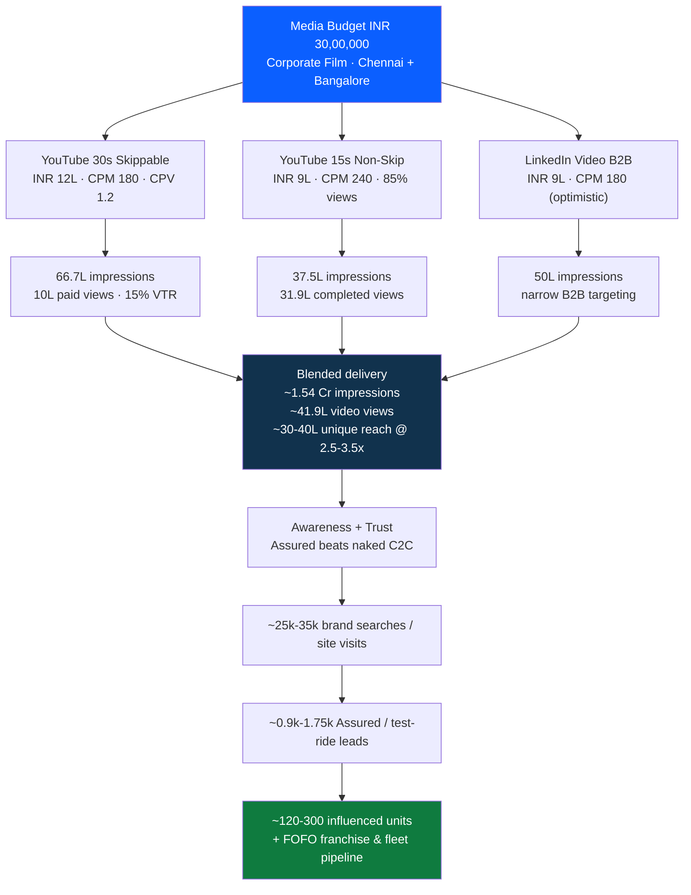

# DriveX — ₹30 Lakh Corporate Film Media Impact Analysis

> **Authored by:** Performance Marketing Strategist 8F1A
> **Brief:** Project the impact of a ₹30,00,000 media budget behind a corporate film for **DriveX** (used two-wheeler procurement + resale) across **Chennai & Bangalore**.
> **Status:** Modeled estimate. Numbers are reconciled to the stated budget and shown with their formulas. Projected business impact is an assumption-based model, **not a guarantee**.

---

## 1. TL;DR (read this if nothing else)

A ₹30L corporate-film flight, run the way it is briefed, buys roughly:

| Outcome | Estimate |
|---|---|
| Total served impressions | **~1.54 crore** (~15.4M) |
| Total video views (YouTube) | **~41.9 lakh** |
| 30s film fully/long-watched (paid views) | **~10 lakh** |
| 15s trust-hook completed views | **~31.9 lakh** |
| Unique reach (Chennai + Bangalore) | **~30–40 lakh** people at **~2.5–3.5x** avg frequency |
| Blended CPM | **~₹195** (rises to **~₹249** if LinkedIn is priced realistically) |

**The strategic point:** this is an **upper-funnel trust play**, not a last-click sales engine. DriveX's whole category problem is *trust* — your own model admits the plain C2C listing carries **"no trust, no liability."** The film's job is to move buyers from *"used bikes are risky"* to *"DriveX Assured is accountable."* If it does that, the modeled downstream is **~25k–35k brand searches/site visits → ~0.9k–1.75k Assured/test-ride leads → ~120–300 influenced unit sales**, plus a B2B **FOFO franchise + fleet pipeline** from LinkedIn. The dominant return is **brand equity + trust + franchise pipeline**, which compounds well beyond the flight.

---

## 2. Business context (why media has to do a specific job)

**DriveX** procures and resells used two-wheelers in **Chennai** and **Bangalore**, with two purchase paths:

1. **Plain C2C** — seller lists on DriveX.com, buyer and seller transact directly. **DriveX carries no liability and lends no trust.** This is a marketplace-liquidity layer, not a brand promise.
2. **DriveX Assured (still C2C, but DriveX-backed)** — DriveX is **liable for the product**, delivered through:
   - **COCO** — Company Owned, Company Operated
   - **FOFO** — Franchise Owned, Franchise Operated

The used-2W category is **trust-deficit by default**. The differentiator that earns a price premium and repeat business is **Assured** (inspection + warranty + accountability). So the corporate film must do two jobs at once:
- **B2C:** reframe used-bike buying around the **Assured** promise (de-risk the purchase).
- **B2B:** use the brand halo to recruit **FOFO franchisees** and open **fleet/corporate** conversations — this is where LinkedIn earns its budget.

---

## 3. The media plan, reconciled to ₹30,00,000

The brief contains a few inconsistent fragments (see §7). Here is the clean reconciliation I am modeling against — the **primary scenario** — plus the literal as-briefed ranges.

| Channel | Asset | Budget | CPM | Other inputs |
|---|---|---:|---:|---|
| YouTube | 30s skippable in-stream | **₹12,00,000** | ₹180 | CPV ₹1.2 |
| YouTube | 15s non-skippable | **₹9,00,000** | ₹240 | 85% video-view rate |
| LinkedIn | Video (B2B) | **₹9,00,000** | ₹180\* | narrow B2B targeting |
| **Total** | | **₹30,00,000** | | |

\* The brief's LinkedIn CPM of ₹180 is **not realistic for India** (see §7). The literal brief gives the 15s line a budget range of **₹6L–₹9L**; if the 15s line is ₹6L, LinkedIn becomes ₹12L. I model the **12 / 9 / 9** split as primary.

---

## 4. Channel-by-channel impact math

### 4.1 YouTube — 30s skippable (TrueView in-stream)

You pay **per view** (CPV), and CPM is the cost of serving 1,000 impressions.

```
Paid views        = Budget / CPV   = 12,00,000 / 1.2   = 10,00,000 views   (10 lakh)
Served impressions= Budget / CPM x 1000 = 12,00,000 / 180 x 1000 = 66,66,667 (~66.7 lakh)
Implied VTR       = views / impressions = 10,00,000 / 66,66,667 = 15.0%
```

**Read:** 15% view-through on skippable in-stream is **healthy and internally consistent** — the CPV and CPM you supplied agree with each other. ~10 lakh people watch enough of the 30s film to be counted as a paid view. This is your **brand-story** workhorse.

### 4.2 YouTube — 15s non-skippable (forced view)

Non-skip is bought on **CPM** (you cannot pay per view); the 85% is the effective viewable-completed rate.

```
Served impressions= 9,00,000 / 240 x 1000 = 37,50,000 (37.5 lakh)
Completed views   = 85% x 37,50,000       = 31,87,500 (~31.9 lakh)
Cost / completed view = 9,00,000 / 31,87,500 = ~₹0.28
```

**Read:** This is your **guaranteed message-delivery** line — ~31.9 lakh forced, completed views of the **trust hook** at ₹0.28 each. Put the **Assured / liability** message here; you control exactly what gets seen.

### 4.3 LinkedIn — video (B2B)

```
At briefed CPM ₹180:   9,00,000 / 180 x 1000 = 50,00,000 impressions (50 lakh)
At realistic CPM ₹550: 9,00,000 / 550 x 1000 = 16,36,364 impressions (~16.4 lakh)
```

**Read:** LinkedIn's value here is **precision, not scale** — targeting by **job title, seniority, company size, industry, and geo** across Chennai + Bangalore. Treat the ₹180 CPM as best-case; plan operationally on **~16–18 lakh** quality B2B impressions. This line should carry **FOFO franchise recruitment** (lead-gen forms) and **fleet/corporate BD**, not just awareness.

---

## 5. Blended delivery, reach & frequency

| Metric | Primary (briefed CPMs) | Realistic LinkedIn CPM |
|---|---:|---:|
| YT skippable impressions | 66.7 L | 66.7 L |
| YT non-skip impressions | 37.5 L | 37.5 L |
| LinkedIn impressions | 50.0 L | 16.4 L |
| **Total impressions** | **~1.54 Cr** | **~1.21 Cr** |
| **Total YT video views** | **~41.9 L** | **~41.9 L** |
| **Blended CPM** | **~₹195** | **~₹249** |

**Reach & frequency (Chennai + Bangalore):**
Combined metro population is ~2.4–2.6 crore. The **targeted, addressable** pool — adults ~22–45, two-wheeler in-market intenders, commuters, gig/first-job buyers, plus the B2B band — narrows to roughly **35–50 lakh** reachable uniques. YouTube video impressions alone (~104 lakh) against a ~40 lakh targeted pool imply ~2.6x raw frequency; with a sensible **3–4/week frequency cap** over a **4–6 week** flight, expect:

> **~30–40 lakh unique people reached at an average frequency of ~2.5–3.5x**, mostly via YouTube. LinkedIn delivers a much smaller, higher-frequency **6–10 lakh professional** reach — by design.

---

## 6. Funnel → business impact model (illustrative)

A corporate film is **upper-funnel**. Here is the modeled cascade for the primary scenario. **Every rate below is a labeled assumption**, shown so you can swap your own.

```
Unique reach                              ~35,00,000
  -> engaged video viewers (long/complete) ~25,00,000 unique
  -> brand-search / direct site visits  @1%  ~25,000 - 35,000
  -> Assured / test-ride / listing leads @3-5%  ~900 - 1,750
  -> closed sales (COCO/FOFO, 30-60 day) @12-18%  ~120 - 300 units
```

**Contribution math (illustrative):**
- Avg used-2W ticket: **₹55,000–₹90,000**
- DriveX Assured gross contribution / unit: **~₹8,000–₹15,000**
- Influenced gross contribution: **~₹10L–₹45L** over the attribution window

So on a **contribution basis the film can approach or exceed payback within 1–2 sales cycles** — but treat that as upside, not the headline. The headline returns are **(a) brand salience & trust** that lift every downstream channel's conversion, and **(b) the B2B pipeline**: even 6–10 lakh professional impressions can yield **~50–150 FOFO franchise enquiries** and several fleet/corporate conversations. **One signed FOFO franchise can outweigh the entire ₹30L media cost.**

### Media-flow visualization



> Editable diagram: open the live link in the PR description, or paste the block above into [mermaid.live](https://mermaid.live).

---

## 7. Brief sanity-check (where the numbers need correcting)

A strategist's first job is to protect you from your own spreadsheet.

1. **LinkedIn CPM ₹180 is unrealistically low for India.** Real LinkedIn CPMs are typically **₹450–₹700+**. Plan on ~16–18 lakh impressions from the ₹9L line, **not** 50 lakh. Re-baseline the deck before anyone presents 50 lakh upward.
2. **CPV ₹1.2 + CPM ₹180 ⇒ 15% VTR.** This one is **consistent — keep it.** Just confirm the bid strategy (target CPV vs. maximize views).
3. **"CPM @ 45" inside the 15s line is inconsistent with ₹240.** A ₹45 CPM cannot coexist with a ₹240 non-skip buy. Most likely it is either (a) a typo, or (b) a **separate cheap-reach line** (YouTube Shorts / Display / bumper). If a ₹45 CPM reach buy is genuinely available, **add it** — it is excellent cheap top-funnel and a retargeting-pool builder (₹3L at ₹45 CPM ≈ 66 lakh extra impressions).
4. **"OTP code / precise control"** — there is no "OTP" lever in Google/LinkedIn Ads, and OTPs should never be shared. I read "precise control" as **frequency capping + tight audience controls** (demo → in-market → topics/affinity → household-income layering). That is the right instinct; implement it as caps + audience layering.
5. **One film is not a campaign.** Cut the master film into **6s bumper / 15s non-skip / 30s skippable / 60s+ LinkedIn-and-site** versions and **sequence** them.
6. **Out-of-scope fragments ignored.** The brief also contained "migrate and claim all tools" and "core mainnet 5 package" — these appear to be stray crypto/onboarding text and are **not** part of a media plan, so I have set them aside. Flag me if they were intentional.

---

## 8. The plan I would actually run

**Budget split (optimized):**

| Line | Share | Budget | Role |
|---|---:|---:|---|
| YouTube 30s skippable | 40% | ₹12.0L | Brand story / founder & Assured narrative |
| YouTube 15s non-skip | 30% | ₹9.0L | Forced-view trust hook (Assured = accountable) |
| LinkedIn video + lead-gen | 20% | ₹6.0L | FOFO franchise recruitment + fleet/corporate BD |
| Retargeting + cheap reach (Shorts/Display) | 10% | ₹3.0L | Convert viewers; build & re-engage pools |

**Execution:**
- **Sequenced storytelling:** 15s non-skip hook → 30s skippable story → retarget viewers with an **Assured CTA** (book a test ride / browse Assured stock).
- **Audience layering:** demo → in-market (used vehicles / two-wheelers) → affinity & topics → household-income band; build a **retargeting pool** from all video viewers; run **lookalikes off actual Assured buyers**.
- **Geo-fencing:** radius-target **COCO/FOFO store catchments** in Chennai & Bangalore to drive store visits.
- **Frequency cap:** 3–4 / week to stop waste.
- **LinkedIn dual-purpose:** B2C trust film **and** FOFO franchise lead-gen forms + fleet/corporate targeting by title/industry.

---

## 9. Measurement framework (so the spend is judged on outcomes)

| Funnel stage | Primary KPI | Measurement method |
|---|---|---|
| Awareness | Reach, frequency, completed views | YouTube/LinkedIn reporting; **Google Brand Lift** (ad recall) |
| Consideration / Trust | Consideration, favorability, **trust lift** | Brand Lift survey; branded **search-lift** |
| Intent | Brand searches, site sessions, video-viewer site visits | GA4 + **view-through** site visits; Search Console |
| Action | Assured enquiries, test-ride bookings, **store visits** | GA4 events, store-visit conversions, call tracking |
| B2B | FOFO franchise leads, fleet conversations | LinkedIn lead-gen forms + CRM |

**Reporting stack (already connectable in this repo's tooling):** pipe YouTube, LinkedIn, GA4, and Search data into a single dashboard via **Supermetrics / Windsor.ai / Coupler.io** so reach, search-lift, and Assured-enquiry volume sit on one weekly view. Run a **pre-flight reach forecast** (YouTube Reach Planner) and a **post-flight Brand Lift** to prove the trust shift, which is the entire point of the film.

---

## 10. Assumptions & disclaimer

- All deliverable counts are derived purely from the **stated budgets, CPMs, CPV, and view rates** using the formulas shown; they are arithmetic, not predictions.
- Reach, frequency, and the entire **funnel → sales** cascade are **modeled estimates** based on category-typical rates, explicitly labeled, and provided so DriveX can substitute its own benchmarks.
- Actual results depend on creative quality, auction dynamics, seasonality, audience definitions, and landing-page/store conversion — none of which a media plan can guarantee.
- LinkedIn delivery is modeled with a **reality-checked CPM band**; do not present the ₹180-CPM impression figure as a commitment.
