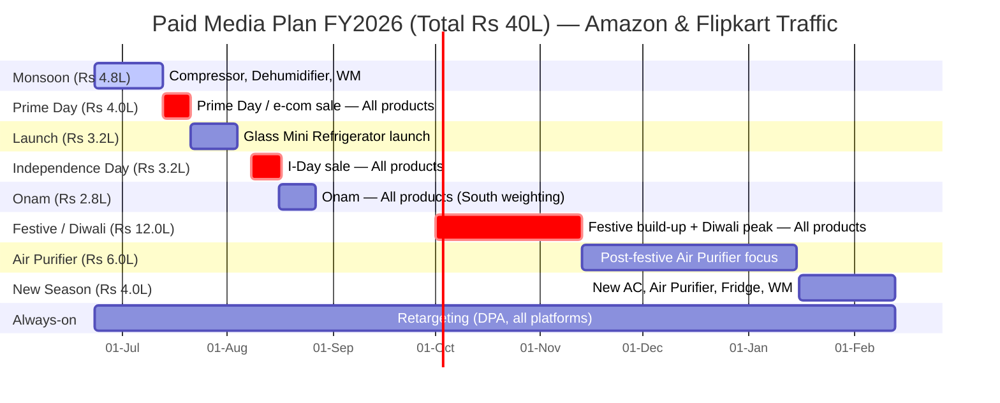

# Paid Media Plan FY2026 — Amazon & Flipkart Traffic (Total ₹40,00,000)

**Objective:** Drive qualified, high-intent traffic to **Amazon & Flipkart** product listings to improve discovery, sales intent, and conversions.
**Strategic levers:** Traffic quality > volume · Always-on retargeting · Seasonal demand capture · Festive purchase intent.
**Total paid media budget (all-inclusive):** **₹40,00,000 (₹40L)**
**Flight:** 23 Jun 2026 → 13 Feb 2027 (always-on retargeting throughout).

> All figures are directional planning benchmarks for Indian retail / consumer-durables inventory (2026), to be trued-up after the first 2 weeks of live data.

---

## 1. Platform-wise Budget Bifurcation (₹40L)

| Platform | Split | Budget | Why |
|---|---|---|---|
| **Meta (FB + IG)** | **50%** | **₹20.0L** | Best qualified-traffic engine; granular targeting; strongest retargeting (DPA / Advantage+ Catalog); lowest cost per quality landing-page view. |
| **GDN** | **25%** | **₹10.0L** | Lowest CPC; cheapest incremental reach; efficient display remarketing + Custom Intent across the long appliance consideration cycle. |
| **Programmatic Display** | **25%** | **₹10.0L** | Premium + contextual (weather/AQI) inventory; DV360 cross-device retargeting. Highest CPC of the three → capped at 25%. |
| **Total** | **100%** | **₹40.0L** | |

---

## 2. Exact Timeline, Budget & Projected Delivery by Phase

Per-phase delivery uses the blended 50/25/25 platform mix (blended CPM ≈ **₹61**, blended CPC ≈ **₹7.6**, blended CTR ≈ **0.80%**). Sessions = clicks × landing rate (~83% blended).

| # | Phase | Exact Window | Days | Product Focus | Budget | Impressions | Clicks | **Sessions** |
|---|---|---|---|---|---|---|---|---|
| 1 | **Monsoon** | 23 Jun – 12 Jul 2026 | 20 | Compressor, Dehumidifier, Washing Machine | ₹4.8L | 7.84M | 62,900 | 52,100 |
| 2 | **Prime Day / sale** | 13 Jul – 20 Jul 2026 | 8 | All products | ₹4.0L | 6.54M | 52,400 | 43,400 |
| 3 | **Glass Mini Fridge launch** | 21 Jul – 03 Aug 2026 | 14 | Glass Mini Refrigerator | ₹3.2L | 5.23M | 41,900 | 34,700 |
| 4 | **Independence Day** | 08 Aug – 16 Aug 2026 | 9 | All products | ₹3.2L | 5.23M | 41,900 | 34,700 |
| 5 | **Onam** | 16 Aug – 26 Aug 2026 | 11 | All products (South wt.) | ₹2.8L | 4.58M | 36,700 | 30,400 |
| 6 | **Festive / Diwali** | 01 Oct – 12 Nov 2026 | 43 | All products | ₹12.0L | 19.61M | 157,200 | 130,300 |
| 7 | **Air Purifier focus** | 13 Nov 2026 – 14 Jan 2027 | 63 | Air Purifier | ₹6.0L | 9.80M | 78,600 | 65,100 |
| 8 | **New-season push** | 16 Jan – 13 Feb 2027 | 28 | New AC, Air Purifier, Fridge, WM | ₹4.0L | 6.54M | 52,400 | 43,400 |
| | **Total** | **23 Jun 26 – 13 Feb 27** | | | **₹40.0L** | **65.37M** | **524,000** | **434,200** |

*Diwali 2026 falls ~8 Nov; Phase 6 front-loads the 3-week build-up into the peak week. Sale/festive phases typically run CPM +15–25% with CTR +20–30% (high intent) — net CPC stays roughly flat to slightly better; table holds blended rates for planning consistency.*

---

## 3. Delivery Detail by Platform (full flight, ₹40L)

| Platform | Budget | CPM | Impressions | CTR | **Clicks** | **CPC** | Sessions | Reach\* |
|---|---|---|---|---|---|---|---|---|
| **Meta** | ₹20.0L | ₹100 | 20.00M | 1.30% | 260,000 | ₹7.7 | 221,000 | ~5.7M |
| **GDN** | ₹10.0L | ₹27 | 37.04M | 0.60% | 222,200 | ₹4.5 | 177,800 | ~9.3M |
| **Programmatic** | ₹10.0L | ₹120 | 8.33M | 0.50% | 41,700 | ₹24.0 | 35,400 | ~2.7M |
| **Total / Blended** | **₹40.0L** | **₹61** | **65.37M** | **0.80%** | **523,900** | **₹7.6** | **434,200** | **~17.7M** |

\* Unique reach indicative at assumed frequency (Meta ~3.5×, GDN ~4×, Prog ~3×); gross, not de-duplicated across platforms.

**Headline:** ~**₹7.6 blended CPC**, ~**524K clicks**, ~**434K qualified sessions** to Amazon/Flipkart. Meta + GDN drive ~92% of clicks at ≤₹7.7 CPC; Programmatic is judged on view-through assisted conversions, not CPC.

---

## 4. Gantt Chart (timeline × budget)

Rendered chart: `media-plans/gantt-fy2026.png`. Source (Mermaid) below — paste into any Mermaid renderer to regenerate.

---

## 5. Campaign Objective by Platform

| Platform | Primary | Secondary / Layer | Optimization |
|---|---|---|---|
| **Meta** | Traffic (Link Clicks → LPV) | Advantage+ Catalog DPA (Sales); Reach for launch/festive | Advantage+ Shopping in Prime Day & Diwali |
| **GDN** | Website Traffic (Optimized Targeting) | Display Remarketing; Demand Gen | Max Clicks → tCPA once signal stabilizes |
| **Programmatic (DV360)** | Consideration / Reach (premium + contextual) | Cross-device retargeting; festive PMP deals | Viewable CPM + frequency control |

---

## 6. Audience Targeting

**Prospecting:** in-market (ACs, Refrigerators, Washing Machines, Air Purifiers, Home Appliances); Custom Intent on category + competitor + "buy on Amazon/Flipkart" terms; interest/demo (home improvement, new movers, new parents) 25–54 Metro + Tier-1/2; lookalikes 1–3% (visitors, ATC, viewers, purchasers).
**Seasonal/contextual:** monsoon humidity → dehumidifier/WM · AQI/pollution + North weighting → Air Purifier (Nov–Jan) · temperature + hot-region → AC/Refrigerator (mid-Jan).
**Retargeting (always-on):** tiered 7/30/60/90-day visitors, PDP viewers, cart abandoners, 50/75% video viewers, engagers; DPA by viewed SKU with live marketplace price; cross-device recovery via DV360.

---

## 7. Retargeting Approach

1. Build audience pools in Phases 1–3 ahead of the big sale windows.
2. Sequenced: awareness → consideration → DPA with live marketplace offer.
3. DPA across Meta + GDN + DV360 by viewed SKU.
4. Recency tiering: 7-day (offer-led) → 30/60/90-day (re-engage).
5. Cross-device recovery via DV360 (desktop research → mobile purchase).
6. Spend weight ~30% always-on, scaling to **~45%** during Prime Day / I-Day / Diwali.
7. Guardrails: frequency caps, exclude recent purchasers, suppress bounced sessions from LAL seeds.

---

## 8. Measurement & Optimization

- **North-star:** qualified marketplace sessions + assisted conversions (Amazon Attribution / Flipkart Ads).
- **Quality KPIs:** LPV rate, bounce/quick-back rate, cost per quality session, retargeting ROAS proxy.
- **Cadence:** weekly optimization · 2-week true-up · post-phase review.
- **Reallocation rule:** shift up to 15% of a phase budget mid-flight to the top performer without re-approval.

*Directional planning benchmarks — refine against live delivery data.*
